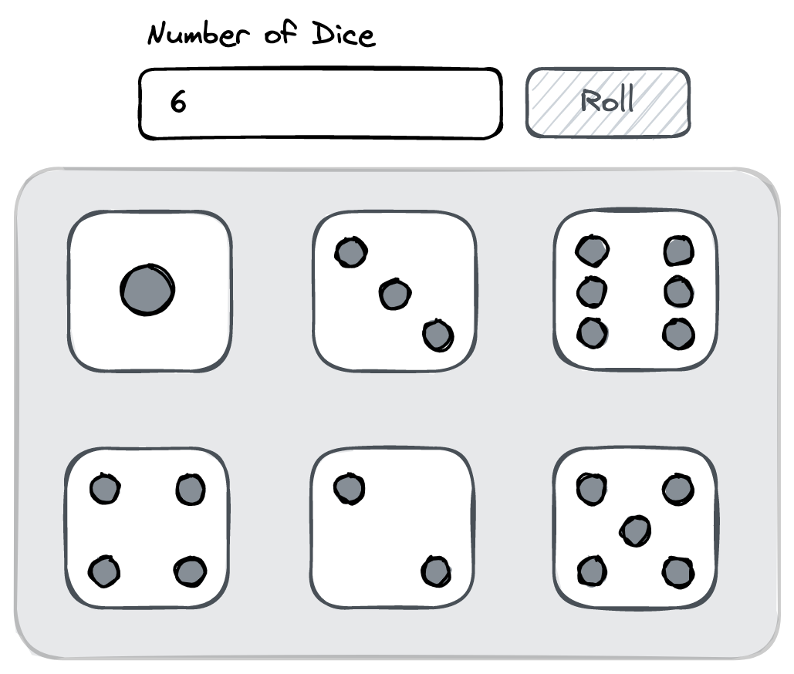

# Frontend Dice Roller Exercise

## Overview

Build a dice roller app that simulates the results of rolling a specified number of 6-sided dice.

## Requirements

-   The user can specify the number of dice to roll using the input field and the value can be an integer between 1 to 12 inclusive.
-   Upon clicking the "Roll" button, the dice roll is simulated and the results are displayed.
-   The results of the dice roll should be displayed in rows of three.

The example below shows a potential result of rolling 6 dice.

## Plus Points

-   Implement a "Reset" button to reset the dice roller.
-   Implement a "Roll All" button to roll all the dice at once.
-   Implement a "Roll One" button to roll one die at a time.
