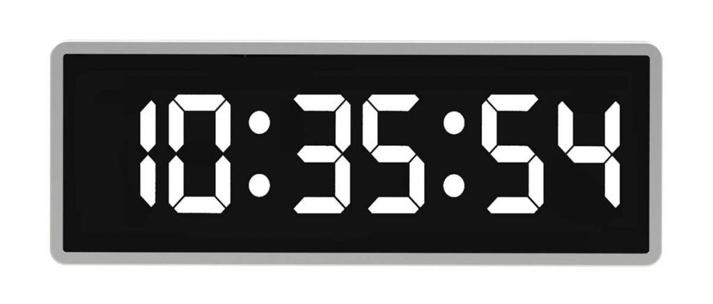

# Frontend Digital Clock Exercise

## Overview

Create a widget that renders the current time in HH:MM:SS format using a 7-segment digital display. You are free to choose to use 12-hour or a 24-hour display.

Here's an example of a digital clock. Each digit needs to be rendered by individual segments, but you can exercise your creativity by choosing different colors and styling it differently. It should however still function as a clock, allowing the user to read the time.

## Requirements

-   The clock should be rendered in HH:MM:SS format.
-   The clock should be rendered in a 7-segment digital display.
-   The clock should be rendered in a 12-hour or 24-hour format.

## Plus Points

-   Implement a "24-hour" button to toggle the clock between 12-hour and 24-hour format.
