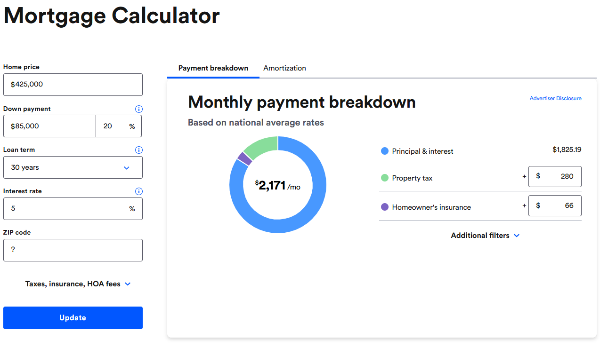

# Frontend Mortgage Calculator Exercise

## Overview

Build a simple mortgage calculator widget that takes in a loan amount, interest rate, loan term, and calculates the monthly mortgage payment, total payment amount, and total interest paid.

## Requirements

-   The user should be able to enter:
    -   Loan amount ($)
    -   Annual interest rate (%). This is also known as the annual percentage rate (APR)
    -   Loan term (in years)
-   Using the inputs, the calculator should compute the following and display the results to the user:
    -   Monthly mortgage payment
    -   Total payment amount
    -   Total interest paid
-   If a non-numerical string is entered into any input field, the calculator should display an error message. Additionally, the calculator should handle any other invalid inputs that may arise.
-   Round the result amounts to 2 decimal places.

_The last two requirements might not be given to you during interviews, you're expected to clarify._

The formula for calculating the monthly payment is:

```
M = P(i(1+i)n)/((1+i)^n - 1)
```

Where:

-   M: Monthly mortgage payment
-   P: Loan amount
-   i: Monthly interest rate (APR / 12)
-   n: Total number of payments (loan term in years x 12)

## Example

If the user enters:

-   Loan amount: $300,000
-   Annual interest rate: 3.5%
-   Loan term: 30 years

The calculator should compute the following:

-   Monthly mortgage payment: $1,430.89
-   Total payment amount: $515,120.40
-   Total interest paid: $215,120.40

Please, refer to the screenshot below for the expected output:


